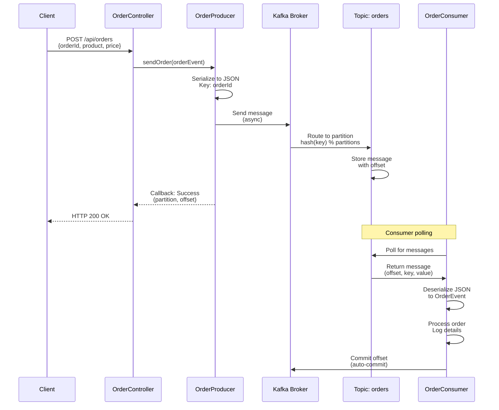
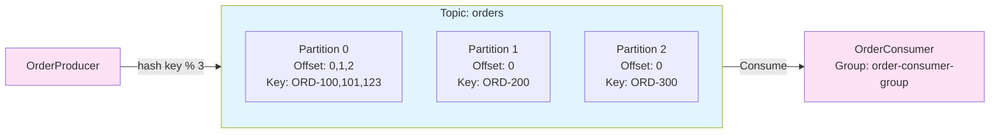
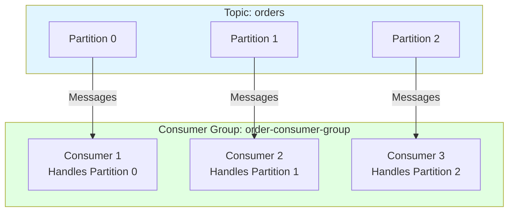
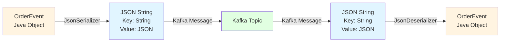

# Kafka Flow - Visual Representation

## 🎨 Interactive Diagrams (Mermaid)

### Complete System Architecture
```mermaid
graph TB
    Client[HTTP Client<br/>Browser/Postman] -->|POST /api/orders| Controller[OrderController<br/>REST API]
    Controller -->|sendOrder| Producer[OrderProducer<br/>Service]
    Producer -->|KafkaTemplate.send| Kafka[Kafka Broker<br/>localhost:9092]
    Kafka -->|Topic: orders| Topic[Kafka Topic<br/>orders<br/>Partitions: 0,1,2]
    Topic -->|Poll Messages| Consumer[OrderConsumer<br/>@KafkaListener]
    Consumer -->|Process| Business[Business Logic<br/>Update Inventory<br/>Payment Service]
    
    style Client fill:#e1f5ff
    style Controller fill:#fff4e1
    style Producer fill:#ffe1f5
    style Kafka fill:#e1ffe1
    style Topic fill:#f5e1ff
    style Consumer fill:#ffe1f5
    style Business fill:#fff4e1
```

### Message Flow Sequence


### Topic Partition Structure


### Consumer Group Distribution


### Serialization/Deserialization Flow


---

## 🏗️ Architecture Overview

```
┌─────────────────────────────────────────────────────────────────────────┐
│                         SPRING BOOT APPLICATION                          │
│                                                                           │
│  ┌──────────────┐         ┌──────────────┐         ┌──────────────┐    │
│  │   REST API   │────────▶│   Producer   │────────▶│   Consumer   │    │
│  │  Controller  │         │   Service    │         │   Service    │    │
│  └──────────────┘         └──────────────┘         └──────────────┘    │
│         │                        │                           │           │
│         │                        │                           │           │
└─────────┼────────────────────────┼───────────────────────────┼──────────┘
          │                        │                           │
          │                        │                           │
          ▼                        ▼                           ▼
    ┌─────────┐            ┌──────────────┐            ┌──────────────┐
    │  HTTP   │            │    KAFKA     │            │   KAFKA      │
    │ Client  │            │   PRODUCER    │            │   CONSUMER   │
    └─────────┘            └──────────────┘            └──────────────┘
                                    │                           │
                                    │                           │
                                    ▼                           ▼
                          ┌─────────────────────┐
                          │   KAFKA BROKER      │
                          │   localhost:9092    │
                          │                     │
                          │  ┌───────────────┐  │
                          │  │  TOPIC:       │  │
                          │  │  "orders"     │
                          │  │               │  │
                          │  │  Partition 0  │  │
                          │  │  Partition 1  │  │
                          │  │  Partition 2  │  │
                          │  └───────────────┘  │
                          └─────────────────────┘
```

## 📊 Detailed Message Flow

### Step 1: HTTP Request
```
┌─────────────┐
│   Client    │
│  (Browser/  │
│  Postman)   │
└──────┬──────┘
       │
       │ POST /api/orders
       │ {
       │   "orderId": "ORD-123",
       │   "product": "Laptop",
       │   "price": 999
       │ }
       │
       ▼
┌─────────────────────┐
│  OrderController    │
│  @PostMapping       │
└──────┬──────────────┘
       │
       │ orderProducer.sendOrder(orderEvent)
       │
       ▼
```

### Step 2: Producer Sends Message
```
┌─────────────────────────────────────┐
│      OrderProducer                  │
│                                     │
│  KafkaTemplate<String, OrderEvent>  │
│                                     │
│  sendOrder(OrderEvent order) {      │
│    kafkaTemplate.send(              │
│      topic: "orders",               │
│      key: "ORD-123",                │
│      value: OrderEvent              │
│    )                                │
│  }                                  │
└──────────────┬──────────────────────┘
               │
               │ Serialize (JSON)
               │ Key: "ORD-123" (String)
               │ Value: {"orderId":"ORD-123",...}
               │
               ▼
```

### Step 3: Message in Kafka Topic
```
┌─────────────────────────────────────────────────────────────┐
│                    KAFKA TOPIC: "orders"                     │
│                                                               │
│  ┌───────────────────────────────────────────────────────┐  │
│  │              PARTITION 0                              │  │
│  │  ┌──────┬──────────┬──────────┬──────────┐          │  │
│  │  │Offset│   Key    │   Value  │  Status  │          │  │
│  │  ├──────┼──────────┼──────────┼──────────┤          │  │
│  │  │  0   │ ORD-100  │ {...}    │  ✅      │          │  │
│  │  │  1   │ ORD-101  │ {...}    │  ✅      │          │  │
│  │  │  2   │ ORD-123  │ {...}    │  🆕 NEW  │◄───┐     │  │
│  │  └──────┴──────────┴──────────┴──────────┘     │     │  │
│  └─────────────────────────────────────────────────┼─────┘  │
│                                                    │         │
│  ┌─────────────────────────────────────────────────┼─────┐  │
│  │              PARTITION 1                        │     │  │
│  │  ┌──────┬──────────┬──────────┬──────────┐     │     │  │
│  │  │Offset│   Key    │   Value  │  Status  │     │     │  │
│  │  ├──────┼──────────┼──────────┼──────────┤     │     │  │
│  │  │  0   │ ORD-200  │ {...}    │  ✅      │     │     │  │
│  │  └──────┴──────────┴──────────┴──────────┘     │     │  │
│  └─────────────────────────────────────────────────┼─────┘  │
│                                                    │         │
│  ┌─────────────────────────────────────────────────┼─────┐  │
│  │              PARTITION 2                        │     │  │
│  │  ┌──────┬──────────┬──────────┬──────────┐     │     │  │
│  │  │Offset│   Key    │   Value  │  Status  │     │     │  │
│  │  ├──────┼──────────┼──────────┼──────────┤     │     │  │
│  │  │  0   │ ORD-300  │ {...}    │  ✅      │     │     │  │
│  │  └──────┴──────────┴──────────┴──────────┘     │     │  │
│  └─────────────────────────────────────────────────┼─────┘  │
│                                                    │         │
│  Key Hash("ORD-123") % 3 = 0  ────────────────────┘         │
│  → Message goes to Partition 0                              │
└───────────────────────────────────────────────────────────────┘
```

### Step 4: Consumer Receives Message
```
┌─────────────────────────────────────────────────────────────┐
│                    KAFKA TOPIC: "orders"                     │
│                                                               │
│  Partition 0, Offset 2:                                      │
│  ┌──────────────────────────────────────────────────────┐   │
│  │ Key: "ORD-123"                                       │   │
│  │ Value: {                                             │   │
│  │   "orderId": "ORD-123",                             │   │
│  │   "product": "Laptop",                               │   │
│  │   "price": 999                                       │   │
│  │ }                                                    │   │
│  └──────────────────────────────────────────────────────┘   │
│                          │                                   │
│                          │ Pull Message                      │
│                          ▼                                   │
└───────────────────────────────────────────────────────────────┘
                          │
                          │ Deserialize (JSON)
                          │
                          ▼
┌─────────────────────────────────────┐
│      OrderConsumer                  │
│                                     │
│  @KafkaListener(                    │
│    topics = "orders",               │
│    groupId = "order-consumer-group" │
│  )                                   │
│                                     │
│  listen(ConsumerRecord record) {    │
│    OrderEvent event = record.value()│
│    // Process order...              │
│    // Update inventory              │
│    // Call payment service          │
│  }                                  │
└─────────────────────────────────────┘
```

## 🔄 Complete End-to-End Flow

```
┌──────────┐
│  Client  │
└────┬─────┘
     │
     │ 1. POST /api/orders
     │    {orderId, product, price}
     │
     ▼
┌─────────────────┐
│ OrderController │
└────┬────────────┘
     │
     │ 2. orderProducer.sendOrder()
     │
     ▼
┌─────────────────┐      ┌──────────────────┐
│ OrderProducer   │─────▶│  KafkaTemplate   │
│                 │      │                  │
│ - Serialize     │      │ - String Key     │
│ - Add Key       │      │ - JSON Value     │
│ - Send Async    │      │ - Async Send     │
└─────────────────┘      └────────┬─────────┘
                                  │
                                  │ 3. Send to Kafka
                                  │    Topic: "orders"
                                  │    Key: orderId
                                  │
                                  ▼
                    ┌─────────────────────────────┐
                    │    KAFKA BROKER             │
                    │    localhost:9092           │
                    │                             │
                    │  ┌───────────────────────┐  │
                    │  │  Topic: "orders"      │  │
                    │  │                       │  │
                    │  │  Partition Selection: │  │
                    │  │  hash(key) % partitions│  │
                    │  │                       │  │
                    │  │  [P0] [P1] [P2] ...   │  │
                    │  │   │                    │  │
                    │  │   │ Store Message      │  │
                    │  │   │ with Offset        │  │
                    │  └───┼────────────────────┘  │
                    │      │                       │
                    └──────┼───────────────────────┘
                           │
                           │ 4. Message Available
                           │
                           ▼
                    ┌─────────────────────────────┐
                    │   Consumer Group:           │
                    │   "order-consumer-group"    │
                    │                             │
                    │  ┌───────────────────────┐  │
                    │  │  OrderConsumer        │  │
                    │  │                       │  │
                    │  │  @KafkaListener       │  │
                    │  │  - Polls for messages │  │
                    │  │  - Deserializes JSON  │  │
                    │  │  - Processes event    │  │
                    │  └───────────────────────┘  │
                    └─────────────────────────────┘
                           │
                           │ 5. Process Order
                           │    - Log details
                           │    - Update inventory
                           │    - Call payment service
                           │
                           ▼
                    ┌─────────────────────────────┐
                    │   Offset Committed          │
                    │   (Auto-commit enabled)     │
                    └─────────────────────────────┘
```

## 📦 Message Structure

```
┌─────────────────────────────────────────────────────────┐
│                    KAFKA MESSAGE                         │
├─────────────────────────────────────────────────────────┤
│                                                           │
│  ┌───────────────────────────────────────────────────┐  │
│  │ HEADER                                            │  │
│  │ - Topic: "orders"                                 │  │
│  │ - Partition: 0                                    │  │
│  │ - Offset: 2                                      │  │
│  │ - Timestamp: 2024-01-15 10:30:45                │  │
│  └───────────────────────────────────────────────────┘  │
│                                                           │
│  ┌───────────────────────────────────────────────────┐  │
│  │ KEY (String)                                       │  │
│  │ "ORD-123"                                          │  │
│  │                                                     │  │
│  │ Purpose:                                           │  │
│  │ - Partition routing                                │  │
│  │ - Ordering guarantee                               │  │
│  └───────────────────────────────────────────────────┘  │
│                                                           │
│  ┌───────────────────────────────────────────────────┐  │
│  │ VALUE (JSON - OrderEvent)                         │  │
│  │ {                                                  │  │
│  │   "orderId": "ORD-123",                           │  │
│  │   "product": "Laptop",                            │  │
│  │   "price": 999                                    │  │
│  │ }                                                  │  │
│  └───────────────────────────────────────────────────┘  │
│                                                           │
└─────────────────────────────────────────────────────────┘
```

## 🔑 Key Concepts Illustrated

### 1. **Producer → Topic → Consumer**
```
Producer          Topic          Consumer
   │                │                │
   │───send────────▶│                │
   │                │                │
   │                │───poll─────────│
   │                │                │
   │                │                │───process
```

### 2. **Partitioning by Key**
```
Messages with same key → Same partition
ORD-123 → Partition 0
ORD-123 → Partition 0  (guaranteed)
ORD-456 → Partition 1  (different key)
```

### 3. **Consumer Group**
```
Consumer Group: "order-consumer-group"
    │
    ├── Consumer 1 (handles Partition 0)
    ├── Consumer 2 (handles Partition 1)
    └── Consumer 3 (handles Partition 2)
    
Each message consumed by only ONE consumer in group
```

### 4. **Offset Tracking**
```
Partition 0:
Offset 0: ✅ Consumed
Offset 1: ✅ Consumed
Offset 2: 🆕 New message (next to consume)
Offset 3: ⏳ Not yet produced
```

## 🎯 Real-World Example Flow

```
Time    Component              Action
─────────────────────────────────────────────────────
10:00   Client                 POST /api/orders
                              {orderId: "ORD-123", ...}
                              
10:00   OrderController        Receives request
                              Calls orderProducer.sendOrder()
                              
10:00   OrderProducer          Serializes OrderEvent to JSON
                              Sends to topic "orders"
                              Key: "ORD-123"
                              
10:00   Kafka Broker           Receives message
                              Calculates partition: hash("ORD-123") % 3 = 0
                              Stores in Partition 0, Offset 2
                              
10:00   OrderProducer          Callback: Success!
                              Logs: "Sent key=ORD-123 partition=0 offset=2"
                              
10:00   OrderConsumer          Polls for new messages
                              Receives message from Partition 0, Offset 2
                              
10:00   OrderConsumer          Deserializes JSON to OrderEvent
                              Processes: Logs order details
                              "Consumed record: offset=2 key=ORD-123 value=..."
                              
10:00   Kafka                  Auto-commits offset
                              Next poll will start from offset 3
```

## 🔧 Configuration Flow

```
application.yaml
    │
    ├── spring.kafka.bootstrap-servers
    │   └── localhost:9092 (Kafka broker address)
    │
    ├── spring.kafka.producer
    │   ├── key-serializer: StringSerializer
    │   └── value-serializer: JsonSerializer
    │
    ├── spring.kafka.consumer
    │   ├── group-id: order-consumer-group
    │   ├── auto-offset-reset: earliest
    │   ├── key-deserializer: StringDeserializer
    │   └── value-deserializer: JsonDeserializer
    │
    └── app.topic
        └── orders (topic name)
```

## 📊 Data Flow Summary

```
HTTP Request
    │
    ▼
OrderEvent DTO
    │
    ▼
JSON Serialization
    │
    ▼
Kafka Message (Key + Value)
    │
    ▼
Kafka Topic (Partitioned)
    │
    ▼
JSON Deserialization
    │
    ▼
OrderEvent DTO
    │
    ▼
Business Logic Processing
```

---

**Note**: This visual guide represents the Kafka concepts implemented in your Spring Boot application. The actual flow happens asynchronously, with the producer sending messages without waiting, and consumers processing them independently.

